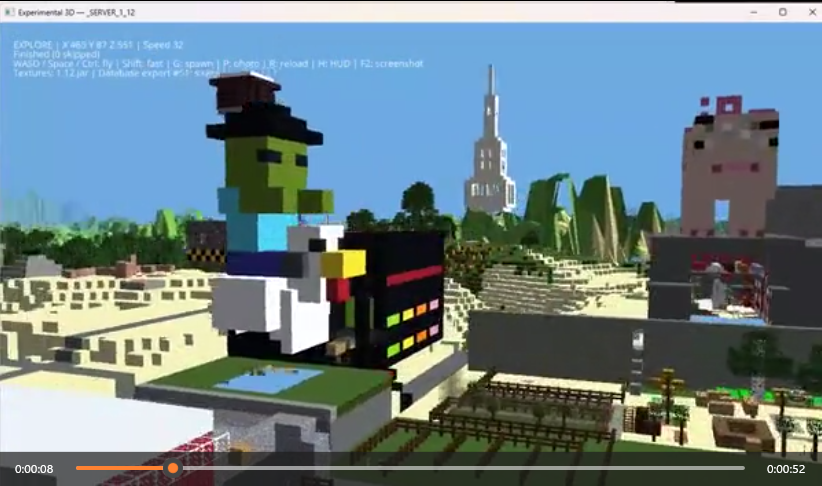

# Minecraft Exporter User Guide

Minecraft Exporter lets you make a local, read-only archive of Minecraft Java Edition worlds. You can inspect world and player information, browse maps, export map images, explore the Overworld in 3D, and save 3D scenes for later viewing.

The exporter never changes your Minecraft saves. Its database, generated maps, screenshots, caches, and logs are stored separately in the user folder configured for the application.


[](https://www.youtube.com/watch?v=S0na1WHUWv8)


## Before you begin

You need:

- Windows with Python 3.12 or newer
- A Minecraft Java Edition world folder, or a folder containing several worlds
- The packages listed in `requirements.txt`
- A working OpenGL graphics driver if you want to use the experimental 3D viewer

Bedrock Edition worlds are not supported.

By default, exported data is stored under the `USER_FOLDER_ROOT` location in `config.json`. The application creates these folders there:

- `data` — the SQLite archive database
- `output` — map files, map caches, 3D caches, and screenshots
- `logs` — application and 3D viewer logs

If necessary, copy `config.example.json` to `config.json` and change `USER_FOLDER_ROOT` to a folder where you want to keep your archive. Use backslashes escaped as `\\` in the JSON path.

## Start the exporter

Open PowerShell in the project folder and run:

```powershell
python -m venv .venv
.venv\Scripts\Activate.ps1
pip install -r requirements.txt
python run.py
```

After the first setup, you normally only need to activate the virtual environment and run `python run.py`.

## Add a world

To import one world:

1. Click **Add World**, or choose **File > Add World**.
2. Select the world folder that contains `level.dat`.
3. Wait for **Import complete** to appear in the status bar.
4. Select the imported world in the **Worlds** list on the left.

To import several worlds at once:

1. Click **Scan**, or choose **File > Scan Folder**.
2. Select a parent folder that contains Minecraft worlds, including worlds in subfolders.
3. Review the number of worlds found and confirm the import.
4. Wait for all imports to finish.

Each scan creates a new import record. If optional player files or individual chunks are damaged, the exporter may report a partial import while preserving everything it could read.

## Refresh an imported world

Select the world, open **Overview**, and click **Import / Refresh**. The exporter reads the current source save again and adds a new import record. Previous import history remains visible in the **Archive** tab.

If the original world folder has moved, add or scan it from its new location.

## Browse the archive

Select a world in the left sidebar, then use the tabs:

- **Summary** shows every archived world in a sortable table. Click a column heading to sort. Selecting a row also selects that world in the sidebar.
- **Overview** shows the selected world's source folder, version, seed, game settings, spawn point, dimensions, player count, and last import time. **Open Source Folder** opens the original save location.
- **Players** lists known players. Select a player to see position, health, food, experience, spawn, last death, inventory, and Ender Chest data when available.
- **Stats & Advancements** lets you choose a player, filter statistics by text, and review advancements.
- **World Data** shows imported dimensions and world properties.
- **Archive** shows the world's import history, source, layout, status, and source size.

Some player names may be blank because the save can contain a UUID without a locally available name.

## Use the map

Select a world and open **Maps**. Tiles for the visible area load automatically. The first visit to an area can take longer because the exporter must read the source regions and build its cache.

Choose a map layer from the first list:

- **surface** — the top visible blocks
- **biome** — biome colouring
- **height** — terrain height
- **activity** — chunk activity recorded by the imported save

Choose a dimension from the second list. Custom Java dimensions appear when the exporter finds them.

Map controls:

- Drag with the left or middle mouse button to pan.
- Use the mouse wheel or **+** and **−** to zoom.
- Click the map and use the arrow keys or WASD to move.
- Click **Go To Spawn** to return to the Overworld spawn.
- Enter X and Z coordinates and click **Go** to jump to a location.
- Click **Fit saved world** to frame the imported chunk extent.
- Enable **Chunk / region grid** to show boundaries.
- Enable **Builds (likely)** to highlight likely construction materials in gold.

Dark areas usually mean no saved terrain exists there or a tile is still loading. The build highlight is an estimate based on visible materials: it can include natural structures and cannot find underground builds.

### Export a map image

Arrange the map exactly as you want it, wait for all visible tiles to finish loading, and click **Export PNG**. Choose a filename and location when prompted.

The PNG contains the currently displayed map area, including the optional grid, spawn marker, and compass. It does not include the toolbar or status text. The file also stores the world, dimension, layer, centre coordinates, and zoom as PNG metadata.

## Use the experimental 3D viewer

The 3D viewer currently displays the Overworld around the spawn or camera location. It represents a bounded loaded area, not the entire world, and some block shapes are simplified.

### Choose textures

Flat colours work without a texture source. For Minecraft textures:

1. Select a world and open **3D Viewer**.
2. Click **Set Texture Source**.
3. Choose either your Java Minecraft installation folder containing `versions`, or a Java client JAR/resource-pack ZIP.
4. Do not select a world folder or server JAR; they do not contain the required client textures.

The selected source is remembered in `config.json`.

### Open and navigate the scene

Click **Open 3D Viewer**. A separate window opens and begins loading terrain.

- **WASD** — fly horizontally
- **Space / Ctrl** — move up or down
- **Shift** — move faster
- **Mouse wheel** — change movement speed
- **G** — return to spawn
- **R** — reload a bounded area around the camera
- **P** — enter or leave Photo mode
- **H** — hide or show the HUD
- **F2** — save a screenshot without the HUD
- **Esc** — release the mouse, leave Photo mode, or close the viewer when the mouse is already released

Click the scene to capture the mouse. In Photo mode, hold the right mouse button and drag to look around. Photo controls let you change the time of day, sun direction, field of view, atmosphere, movement speed, and detailed or distant viewing radii. After changing a radius, use **Reload Around Camera**.

Screenshots are saved below:

```text
<USER_FOLDER_ROOT>/output/3d/worlds/<world UUID>/renders/
```

Each screenshot has a JSON sidecar containing its world, dimension, camera, time, and field-of-view information.

### Replay a saved 3D scene

Every completed live 3D load saves a visual snapshot in the archive database. To replay one:

1. Select the world and open **3D Viewer** in the main application.
2. Click **Refresh Exports**.
3. Select a completed or partial export in the table.
4. Click **Open Saved Scene**.

A saved scene includes its geometry and texture assets, so it can be replayed without the original Minecraft world. You still need this viewer application to display it.

## Make a portable archive backup

Open **3D Viewer** in the main application and click **Save Portable Database**. Save the `.db` file outside all Minecraft source-world folders.

The backup is a consistent copy of the archive database, including all worlds and saved 3D scenes. For long-term access, keep the database together with a copy of this viewer and `docs/3d_archive_format.md`. Map PNG exports and ordinary 3D screenshots are separate files and should be backed up separately if you want to preserve them.

## Troubleshooting

- **No worlds were found:** Select a Java world folder containing `level.dat`, or scan a parent folder containing such worlds.
- **A map is dark or incomplete:** Wait for the visible tiles to finish. Try **Fit saved world** or **Go To Spawn**. Some chunks may genuinely be absent or unfinished.
- **Export PNG is unavailable or asks you to wait:** Keep the map open until every visible tile has loaded.
- **The 3D viewer will not open:** Run `pip install -r requirements.txt`, update your graphics driver, and check `<USER_FOLDER_ROOT>/logs/viewer3d.log` and `viewer3d_console.log`.
- **Textures are missing:** Select a valid Java client JAR, resource-pack ZIP, or installation folder containing `versions`. Unsupported blocks may still use flat colours.
- **An import is partial:** Check `<USER_FOLDER_ROOT>/logs/minecraft_viewer.log`. The exporter retains successfully read data when optional files or chunks fail.
- **A refreshed world looks unchanged:** Confirm that **Open Source Folder** points to the save you intended to refresh.

## What the exporter does not do

The exporter does not edit worlds, launch Minecraft, restore saves, or capture live gameplay. Bedrock worlds, entities, block entities, server logs, screenshot correlation, and exact rendering of every Minecraft block shape are not currently supported.
